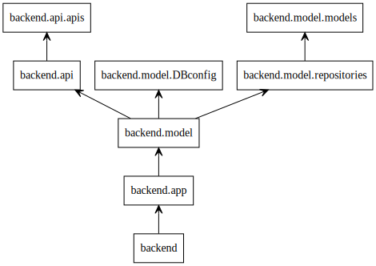
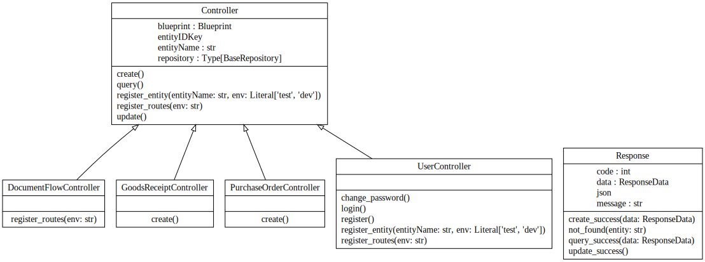
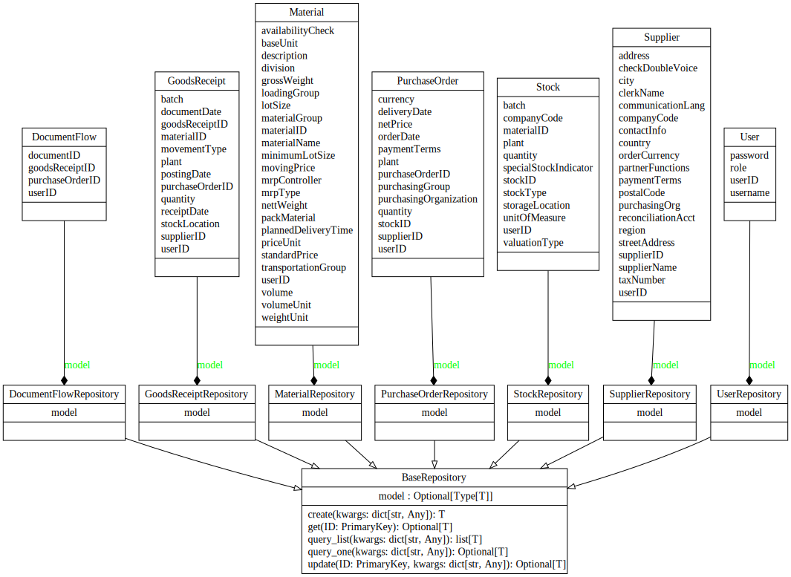

# Package Structure
- api
	- \_\_init\_\_\.py
	- apis\.py
- model
	- \_\_init\_\_\.py
	- DBconfig\.py
	- DBconfig\_private\.py
	- models\.py
	- repositories\.py
- \_\_init\_\_\.py
- \.gitignore
- app\.py
- environment\.yaml
- README\.md
# Package dependency

整个后端通过app\.py文件作为唯一的入口。app\.py引用model子包进行数据交互。model子包引用api子包作为其控制层，model子包自身为数据持久化存储层。
## API dependency

### Response
Response类统一返回参数格式，包括响应状态码code，响应信息message和响应数据data。json属性为json编码后的data。
#### method
create_success(): 创建新数据成功
not_found(): 未找到数据，包括查询和更改过程中的查找
query_success(): 查询数据成功
update_success(): 更改数据成功
### Controller
Controller类统一业务处理逻辑，通过调用model子包中的repository对数据库进行操作。
#### method
create(): 处理创建业务逻辑
query(): 处理查询业务逻辑
update(): 处理更改业务逻辑
register_entity(): 将自己注册到对应的实体类（即数据库中的一张表）
register_routes(): 将自己注册到对应的路由（即接受请求的路由）
#### User Controller
register(): 本质是创建，但是封装成新接口更清晰
login(): 本质是查询，但是需要返回token，故添加token生成的方法
change_password(): 本质是更新，但是需要对比原密码是否正确
register_entity(): 实体类对应关系与基类不同
register_routes(): 请求路由与基类不同
#### Purchase Order Controller
create(): 创建Purchase Order的同时创建Document Flow
#### Goods Receipt Controller
create(): 创建Goods Receipt的同时更改Document Flow
#### Document Flow Controller
register_routs(): 请求路由与基类不同
## model dependency

数据库表对应的ORM，详见数据库说明

